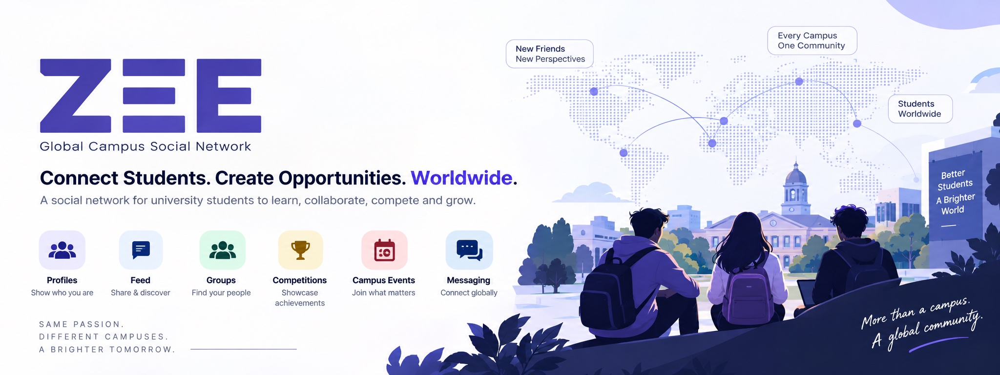

<div align="center">

</div>

<div align="center">

**A global campus social network — open source, multi-university, student-first.**

</div>

---

## Why ZEE?

Campus life today is scattered across generic chat apps and Discord servers — no
verified community, no shared structure for course groups or competitions, and no way
to discover students, groups or events beyond your own campus.

ZEE fixes this with three things:

1. **Verify:** Institutional email OTP ties every account to a real, onboarded
   university. No passwords, no fake accounts — proving you can read mail at a verified
   campus domain *is* the credential.
2. **Connect:** A shared feed, course/club/dorm groups, cross-campus interest groups,
   competitions with team recruiting, campus events with RSVPs, achievements, and direct
   messaging — structured for academic life, not another generic timeline.
3. **Discover *(Phase 2)*:** A RAG campus assistant, student matching, and personalised
   feed ranking — deferred until real usage data exists to actually evaluate them
   against.

---

## Features

* **Institutional Verification:** A one-time code to a verified university inbox is the
  only credential. Domain matching is exact, never a suffix — no lookalike-domain
  loophole.
* **Global, Cross-Campus Network:** Course, club and dorm groups scoped to one
  university; GlobalInterest groups and open competitions that span every campus on the
  platform.
* **Structured Campus Life:** A purpose-built feed, competitions with team recruiting,
  campus events with RSVPs, and a self-reported achievements record.
* **Direct Messaging:** One-to-one conversations between students.
* **AI Campus Assistant *(Phase 2)*:** A chatbot, student matching, and ranked feed —
  real routes and schemas exist today; the logic is owner-maintained and lands once
  there's usage data to build it on.
* **Open, Well-Specified Scaffold:** Every unimplemented piece ships with acceptance
  criteria and a matching skipped test — contributing means filling in a clear spec, not
  reverse-engineering intent.

---

## Architecture Overview

```
                    ┌──────────────────────────────┐
                    │   apps/web — Next.js PWA     │
                    │   TypeScript · Tailwind      │
                    └──────────────┬───────────────┘
                                   │ HTTPS, Bearer JWT
                                   ▼
                    ┌──────────────────────────────┐
                    │  apps/api — ASP.NET Core     │
                    │  Clean Architecture + CQRS   │
                    │  auth · posts · feed · groups│
                    │  competitions · events · DMs │
                    └───┬──────────────────────┬───┘
                        │                      │ X-Internal-Key
        ┌───────────────┴──────┐               │ (never exposed to browsers)
        ▼                      ▼               ▼
┌───────────────┐      ┌─────────────┐  ┌─────────────────────────┐
│  PostgreSQL   │      │    Redis    │  │ apps/ai-service         │
│  + pgvector   │      │ cache/queue │  │ Python · FastAPI        │
└───────────────┘      └─────────────┘  └─────────────────────────┘
```

Full detail — layer boundaries, request lifecycle, data model, the AI boundary, known
gaps: **[docs/Architecture.md](docs/Architecture.md)**.

---

## Project status: Phase 1 scaffolding

**This repository is a scaffold, not a working product yet.** Structure, contracts,
tests and infrastructure are in place; most method bodies are `TODO` stubs carrying
acceptance criteria, waiting to be implemented.

| | |
| --- | --- |
| ✅ Builds and runs | The whole stack starts with one `docker compose up` |
| ✅ CI is green | 70 API tests: 38 passing, 32 skipped stubs, 0 failures |
| ✅ Institutional sign-in works | OTP request/verify, real Neon database, JWT issued and verified |
| ⚠️ Everything else returns **501** | Routed and reachable, handler not implemented yet |

**This is deliberate** — a lot of well-specified, self-contained work is available to
pick up, each with a matching skipped test:

```bash
grep -rn "TODO:" apps/ --include=*.cs --include=*.ts --include=*.py
```

Or browse the 29 open issues on this repo, already ordered by dependency.

---

## Quickstart

**Prerequisites:** Node.js `>= 20`, Docker Desktop (or Docker Engine + Compose v2), and a
free [Neon](https://neon.com) account — **ZEE has no local database container**; every
environment, including development, points at a Neon branch.

### 1. Clone & configure

```bash
git clone https://github.com/dhananjaya-hbc/ZEE-platform.git
cd ZEE-platform

cp infra/.env.example infra/.env
# Fill in NEON_NPGSQL_CONNECTION_STRING, NEON_DATABASE_URL (see docs/Database.md),
# INTERNAL_API_KEY (openssl rand -hex 32), JWT_KEY (openssl rand -base64 48).
```

### 2. Seed a university (needed to sign in)

Your Neon branch starts with zero onboarded universities — see
**[Seeding a university](docs/Database.md#seeding-a-university)** before testing sign-in.

### 3. Start the stack

```bash
docker compose -f infra/docker-compose.yml up --build
```

| Service | URL |
| --- | --- |
| Web app | http://localhost:3000 |
| API + OpenAPI doc | http://localhost:5080 · http://localhost:5080/openapi/v1.json |
| API liveness / readiness | http://localhost:5080/health · /health/ready |
| AI service docs | http://localhost:8000/docs |

> `/api/auth/request-otp` and `/api/auth/verify-otp` work end to end against a real
> database. Everything else currently returns **501 Not Implemented** — the scaffolding
> reporting itself honestly.

Prefer running one app at a time, or need environment-variable details? See
**[CONTRIBUTING.md](CONTRIBUTING.md#running-one-app-at-a-time)**.

---

## Documentation

| Doc | What's in it |
| --- | --- |
| [CONTRIBUTING.md](CONTRIBUTING.md) | **Start here.** Local setup, layer guide, a full worked example, how to claim a stub |
| [docs/Architecture.md](docs/Architecture.md) | Layer boundaries, request lifecycle, data model, auth flow, the feed, known gaps |
| [docs/Database.md](docs/Database.md) | Setting up Neon, branching, seeding a university, migrations |
| [docs/TechStack.md](docs/TechStack.md) | Every dependency and the reason it's there |
| [docs/FolderStructure.md](docs/FolderStructure.md) | Annotated directory tour |
| [docs/AI_DESIGN.md](docs/AI_DESIGN.md) | The Phase 2 plan and the constraints it must respect |
| [docs/Logs.md](docs/Logs.md) | Development log — decisions and their reasoning |

---

## Contributing

Contributions are very welcome — the scaffolding exists so there is clear work to pick
up. Read [CONTRIBUTING.md](CONTRIBUTING.md) first.

Three things to know up front:

- **`main` is the released state and protected** — merges require a reviewed PR, no
  direct pushes, even from maintainers. **Branch from `dev`, PR into `dev`.**
- **`/apps/ai-service` is owner-maintained.** Bug fixes, tooling and infrastructure PRs
  are welcome; the Phase 2 AI logic is reserved. Open an issue to discuss instead.
- **Check issue dependencies first.** Several open issues are marked "Blocked by" —
  GitHub shows this on the issue itself before you start reading.

Report bugs or propose features on the [Issues](https://github.com/dhananjaya-hbc/ZEE-platform/issues) tracker.

---

## License

MIT — see [LICENSE](LICENSE).
